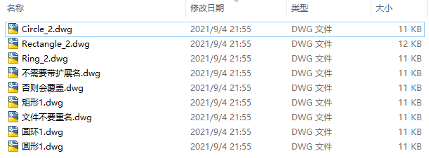
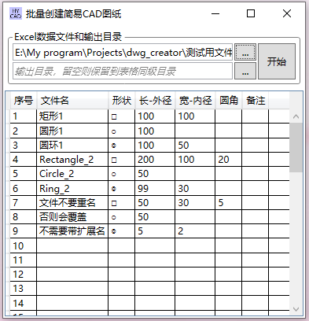

# 批量创建简易CAD（dwg）格式图纸

#### 介绍
根据Excel表格中的数据，批量生成矩形（带或不带圆角）、圆形和环形的简单CAD图形（dwg格式）。  
仅仅适用于板材切割领域（火焰切割、等离子切割、激光切割）的简易图形的批量出图，应用范围极窄。
  
  
  
  

#### 界面

#### 使用说明
1.  按《CAD简单制图数据模板v1.0.xlsx》为样本，录入图形参数并保存。
2.  打开本工具，录入图形参数Excel文件。
3.  可以指定输出目录，否则保存再Excel文件的同级目录。
4.  点击“开始”，开始自动生成dwg文件。

#### 注意事项
我写这个程序只用了几个小时，并不严谨，Bug可能较多，请慎重使用。

#### 程序构架
本程序使用Visual Studio 2017开发，C#语言和.net 4.5框架，并使用如下第三方库：
1. NPOI
2. WindowsAPICodePack
3. TD_Mgd

#### 下载地址和联系方式
1.  下载地址: [https://gitee.com/liuweilhy/dwg_creator/releases](https://gitee.com/liuweilhy/dwg_creator/releases)
2.  联系邮箱：[liuweilhy@163.com](mailto:liuweilhy@163.com)
